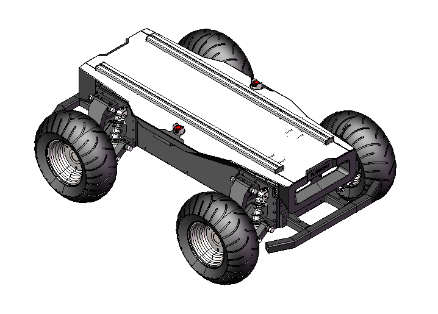
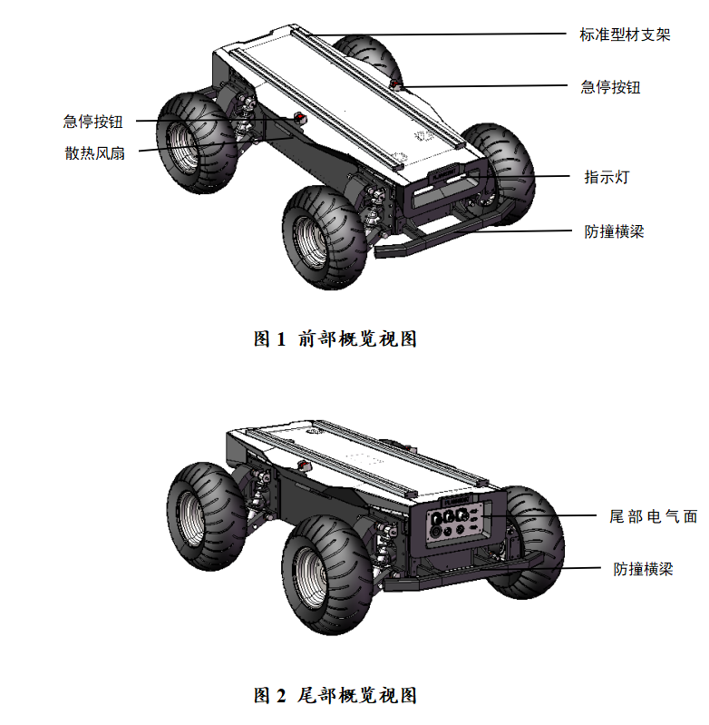

## DR100

[EN](./README_en.md)

## DR100简介

普蓝机器人 DR100是一款四轮四驱差速转向的可编程式移动机器人底盘，4个400W大扭矩伺服电机为其提供强劲动力，结合四轮独立悬挂结构，可轻松驾驭复杂应用环境。30Ah大容量磷酸铁锂电池确保高续航行程，丰富的拓展接口，支持SDK、ROS开发与仿真、高能提升二次开发效率，广泛应用于教育教学、科学研究、厂区巡检及无人驾驶等多个领域。

## 运行

```bash
mkdir -p catkin_ws/src
cd catkin_ws/src
git clone https://github.com/PlanRobotShenZhen/Four-Wheel-4WD-Differential-Steering-Mobile-Robot-Chassis.git
cd ..
catkin_make
```

```bash
source ~/catkin_ws/devel/setup.bash
roslaunch dr100_description run.launch
```

## 产品外观

### 实物图


### 尺寸说明


### 整机概览


## 仿真环境

### RViz可视化


### Gazebo仿真


