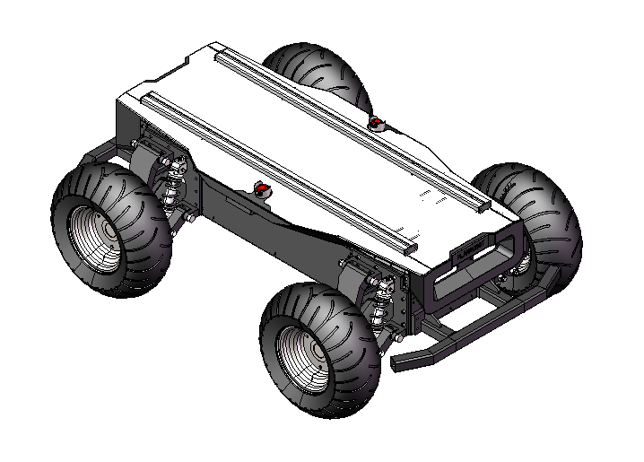
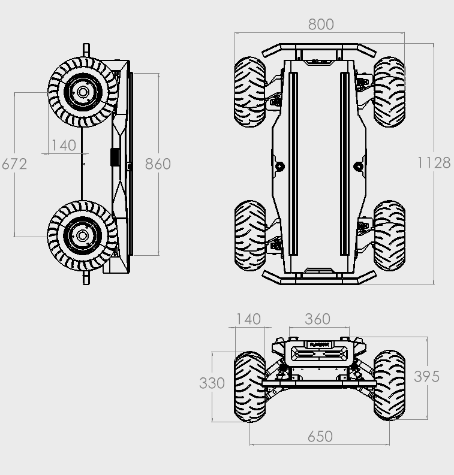
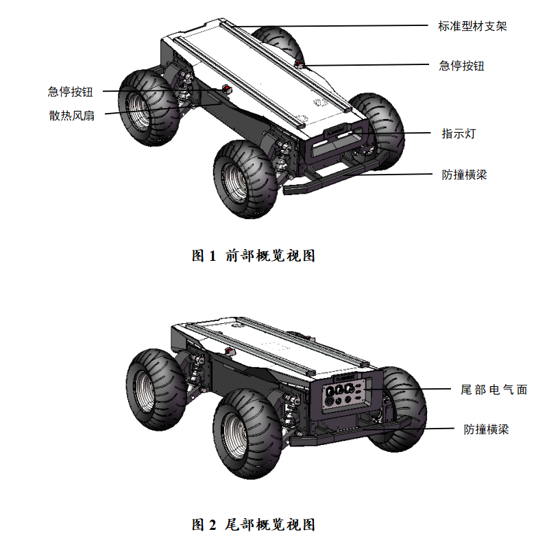
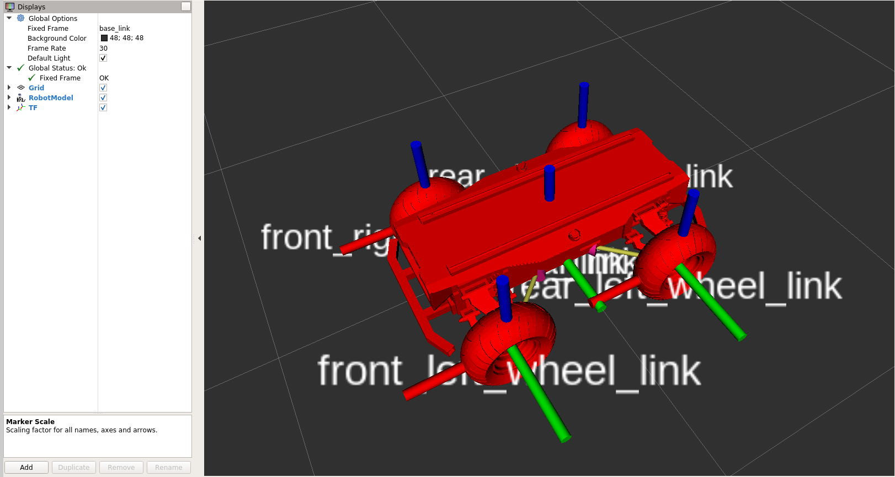
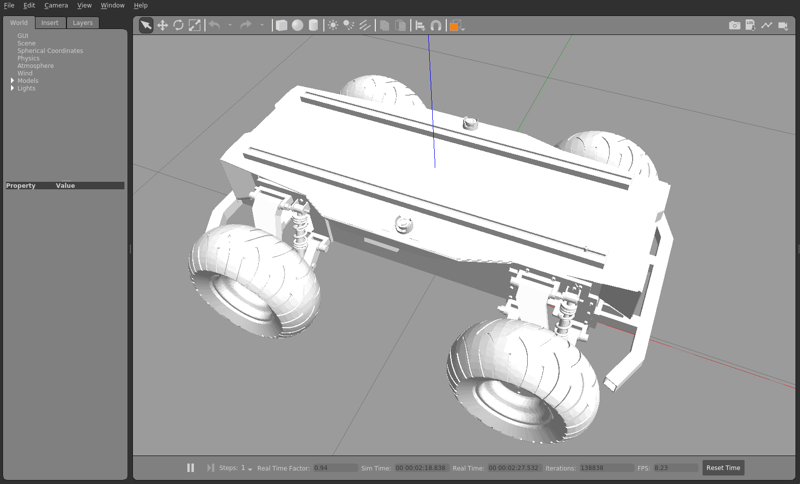

## DR100

[简体中文](./README.md)

## DR100 Introduction

The DR100 from PlanRobot is a four-wheel drive differential steering programmable mobile robot chassis. Equipped with four 400W high-torque servo motors providing powerful drive capability, combined with four-wheel independent suspension structure, it can easily handle complex application environments. The 30Ah high-capacity LiFePO4 battery ensures long operating time. With rich expansion interfaces, it supports SDK, ROS development and simulation, greatly improving secondary development efficiency. The DR100 is widely used in education, scientific research, factory inspection, autonomous driving, and many other fields.

## Running

```bash
mkdir -p catkin_ws/src
cd catkin_ws/src
git clone https://github.com/PlanRobotShenZhen/Four-Wheel-4WD-Differential-Steering-Mobile-Robot-Chassis.git
cd ..
catkin_make
```

```bash
source ~/catkin_ws/devel/setup.bash
roslaunch dr100_description run.launch
```

## Product Appearance

### Physical Product


### Dimensions


### Overall View


## Simulation Environment

### RViz Visualization


### Gazebo Simulation
